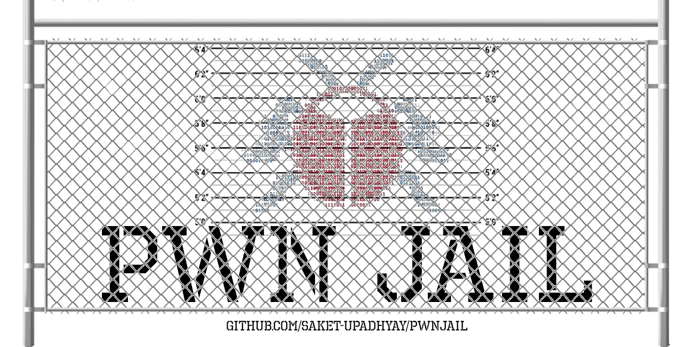

# PwnJail
A nsjail-based, automated vulnerable app/challenge launcher via docker for CTFs and Cybersecurity Training

* Who this is for?
* [How to Build](README.md#how-to-build)
* [How to use](README.md#how-to-use)
* Why PwnJail?
* [Credits](README.md#credits)
* [License](README.md#license)

### Who is this for?
Anyone who wants to set up an isolated environment for their next vulnerable code deployment in minutes!

Example:
1. Cybersecurity Students
2. CTF Organisers
3. Vulnerability Testers

## How to build

1. Clone this repo by `git clone https://github.com/Saket-Upadhyay/PwnJail.git`
2. Copy your vulnerable application in the **./chal** folder
3. If you have a flag, copy it in **./flag/flag**
4. Change your current directory to PwnJail `cd PwnJail`
5. Build docker image by `./BuildDockerimage.sh` or `docker compose build` in the root directory of PwnJail

> Note: You should have a docker image named `pwnjail_launcher`; check this by `docker images`

## How to use
1. Run `runPWNLaunch.sh` and wait for the docker shell to open
2. In docker's shell run `/nsjailexec.sh` or `nsjail --config /etc/nsjail.cfg`
3. To exit press `CTRL+C`

> Note: To run in detached mode type `nsjail --config /etc/nsjail.cfg -d`

### Why PwnJail?
When I was trying to learn ROP and other binary exploits, I stumbled upon many archived CTF challenges but I was not able to set up an environment for them.
It took me 2 days to set up my first docker environment for practice. I understand how painful it can be to do it every time from scratch if something goes wrong or you are setting up a new set of challenges to practice on.

So I took one more day to automate the whole process which works well in 2022 (unlike some old scrap abominations I found on GitHub) so that you can focus on your practice/challenge and leave setting up everything else on PwnJail!

## Credits
1. This project uses Google's opensource NSJail [https://github.com/google/nsjail](https://github.com/google/nsjail)
2. The sample challenge in ./chal/return-to-what is taken from [DownUnderCTF/Challenges_2020_public](https://github.com/DownUnderCTF/Challenges_2020_public/tree/master/pwn/return-to-what)
3. The main banner of this project is created in photoshop using following free vectors and fonts-
* [Wire fence](https://www.freepik.com/free-vector/grid-fence-with-barbed-wire_10385677.htm) vector created by upklyak
* [Octin Prison](https://typodermicfonts.com/octin-prison/) Free by Typodermic Fonts
* [Jail vector](https://www.freepik.com/free-vector/chriminal-height-mugshot-lines-police-verification_10317724.htm) created by starline

## License

This project is made by Saket Upadhyay and is available under [MIT License](https://github.com/Saket-Upadhyay/PwnJail/blob/main/LICENSE).

---
##### Tested on
1. Ubuntu 22.04 kernel 5.15.0; Docker version 20.10.17, build 100c701

Note: NSJail is used in this project is a static build of nsjail 3.1, you can replace contents of ./bin/nsjail to build your prefered version.
